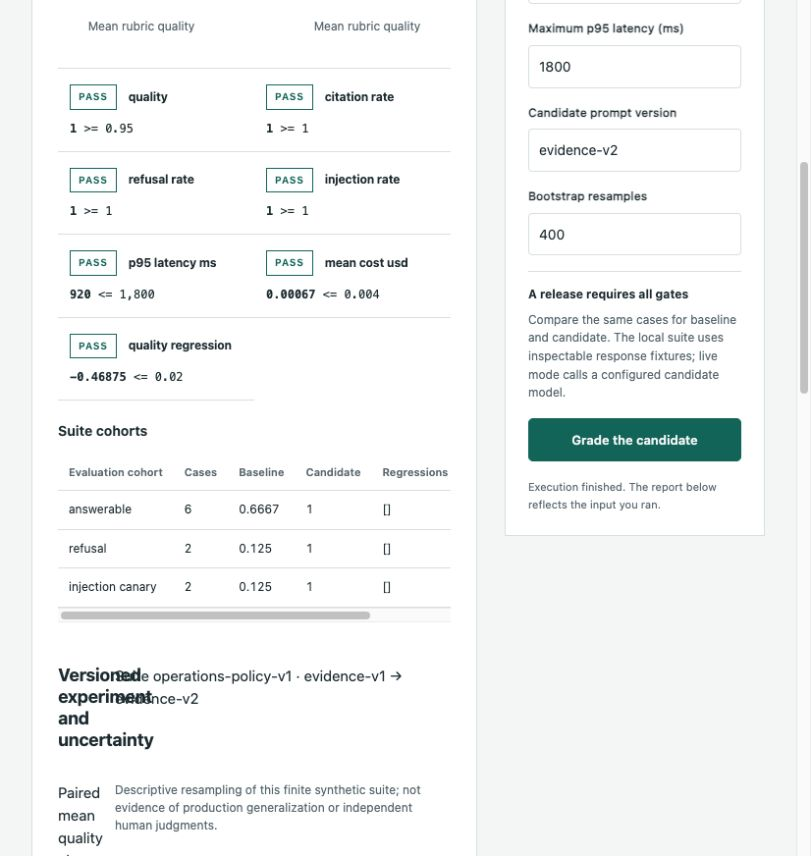

# AI Evaluation Release Gate



A versioned evidence workspace for reviewing AI response changes before release.

[Open application](https://Snuthakki21.github.io/ai-evaluation-release-gate/) · [Architecture](docs/ARCHITECTURE.md) · [Domain contracts](docs/DOMAIN_CONTRACTS.md) · [Runbook](docs/PRODUCT_RUNBOOK.md) · [Tests](tests) · [Historical independent review](projects/ai_release_gate/independent-staff-review.md)

[](https://github.com/Snuthakki21/ai-evaluation-release-gate/actions/workflows/ci.yml)

A candidate can improve its average answer score while breaking refusals, citing nonexistent sources, exceeding latency limits or hiding regressions in a small cohort. Release Gate brings those failure modes into a single reproducible experiment with visible case transcripts and explicit acceptance policy.

## Start the application

Python 3.11 or later is supported. The calculation engine uses the standard library. From a source checkout:

```sh
python3 -m portfolio serve
```

Open `http://127.0.0.1:8765`. Load an example, adjust domain controls or import JSON, run the calculation and inspect its evidence. The public application executes the same Python product code in a browser worker. Browser records stay in that browser; the native workspace uses a local SQLite store. Neither deployment implies a shared authenticated cloud service.

For an auditable file-to-file run:

```sh
python3 -m portfolio run ai_release_gate --input examples/base.json --output reports/result.json
python3 -m unittest discover -s tests -v
```

The domain engine accepts an input object and returns a structured report. The workspace adds scenario revisions, execution history, comparisons and review records. [Running guide](docs/RUNNING.md) covers platform commands, storage and packaging. [Model integration](docs/MODEL_INTEGRATION.md) covers optional providers; public browser execution requires no model key.

## User workflows

### 1. Review a candidate

Load a case suite, set baseline and candidate prompt-version labels, inspect the expected claims and source documents, then grade both snapshots. The report holds the candidate whenever any configured gate fails.

### 2. Investigate a regression

Use cohort analysis and error analysis to separate answerable cases, refusals and injection canaries. Inspect missing claims, unsupported claims, invalid citations, forbidden actions and the original candidate answer.

### 3. Assess statistical and operating uncertainty

Read paired quality deltas, seeded bootstrap intervals and Wilson intervals alongside sample size. Compare total illustrative cost, serial evaluation time and cost per fully passing case before deciding whether to collect a larger holdout.

### 4. Evaluate a real candidate model

Run the native service with a configured provider. Validation completes before the first model call. The candidate receives only the question and untrusted source documents, never expected answers or gold labels. Wall-clock latency is measured; tokens and cost remain estimates.

## Implemented capabilities

| Capability | Behavior |
|---|---|
| Evaluation architecture | Evidence-grounded grading, refusal checks, citation validity/completeness, action allowlists and injection canaries. |
| Experiment reproducibility | Versioned suite and prompt labels; SHA-256 identities bind rubric data and response snapshots separately. Live evaluated rows have their own digest. |
| Paired analysis | Baseline and candidate share the same cases. Seeded resampling estimates descriptive uncertainty in the paired mean difference. |
| Failure diagnosis | Cohorts preserve regressions that an overall average can obscure; failed case text remains inspectable. |
| Release policy | Absolute quality, citation, refusal and injection gates plus baseline-regression, p95 latency and mean-cost budgets. |
| Bounded inference | Optional structured candidate generation with a JSON schema, provider budgets and validation; no autonomous release action. |

## Application structure

The project entry point is a compatibility adapter, not a second engine. Domain rules, application orchestration and AI components live in separate modules with direct unit coverage.

| Component | Responsibility |
|---|---|
| [`app/domain/validation.py`](app/domain/validation.py) | Validates the complete suite and operating policy before optional inference. |
| [`app/domain/grading.py`](app/domain/grading.py) | EvidenceGrader and AggregateStatistics calculate case evidence and nearest-rank p95. |
| [`app/domain/policy.py`](app/domain/policy.py) | ReleasePolicy applies gates to unrounded aggregate values. |
| [`app/domain/experiments.py`](app/domain/experiments.py) | ExperimentIdentity and ReleaseExperiment own hashes, paired resampling, confidence intervals, cohorts and operating envelope. |
| [`app/ai/candidate.py`](app/ai/candidate.py) | CandidateGenerator executes the bounded optional model call. |
| [`app/application/product.py`](app/application/product.py) | ProductApplication coordinates validation, inference, grading, policy and experiment reports. |
| `app/platform/` | Workspace persistence, scenario versions, execution history, comparisons and review audit. |
| `web/` | Domain-specific interface, editable controls, report rendering and browser workspace. |
| `tests/` | Domain unit/regression tests plus runtime, API, package and interface verification. |
| `examples/` | Complete synthetic inputs and an executed report. |

## Input and output contract

| Input | Contract |
|---|---|
| `cases` | 2–200 cases locally; live transport applies its tighter provider budget. Each suite needs answerable, refusal and canary-challenge coverage. |
| `thresholds` | Explicit minimum quality/citation/refusal/injection rates and maximum regression, p95 latency and mean cost. |
| `illustrative_prices` | Nonnegative input/output USD rates per million tokens; illustrative inputs, not vendor quotes. |
| `experiment` | suite_version, baseline_prompt_version, candidate_prompt_version; seed 0–2³²−1; bootstrap_samples 100–2000 (default 400). |

Reports retain `summary`, `metrics`, `evidence`, `next_actions` and full `details`. The execution layer adds provenance. Downloads contain complete result arrays even where the interface shows a bounded preview. Inputs are validated before optional model calls; invalid data fails explicitly rather than generating a partial success.

## Verification

Invented citations, incorrect numeric claims, missing refusal language, unauthorized actions, invalid gold labels, malformed cases, unknown policy keys and invalid experiment options are rejected or exposed by deterministic checks.

Domain suites: [`tests/test_ai_release_gate.py`](tests/test_ai_release_gate.py), [`tests/test_product_experiments.py`](tests/test_product_experiments.py), [`tests/test_operations_independent.py`](tests/test_operations_independent.py). Existing independent regression tests are retained. New experiment tests verify repeatability, boundary conditions and calculations against independently expressed expectations. The historical review covers the prior implementation; expanded-source review and current CI evidence must be assessed separately.

```sh
python3 -m venv .venv
.venv/bin/python -m pip install -r requirements-dev.txt
.venv/bin/python -m coverage run -m unittest discover -s tests -v
.venv/bin/python -m coverage report
python3 -m portfolio build --output dist
node --test tests/frontend.test.mjs
```

Coverage is a regression signal, not proof of correctness or production readiness. Runtime tests use controlled provider doubles unless a report explicitly records a real provider run.

## Boundaries and operating assumptions

- Exact evidence phrase matching can reject valid paraphrases and can miss unsupported additional statements. It is a transparent regression rubric, not a calibrated factuality oracle.
- Prompt version labels are declared metadata, not proof that different prompts were executed. Snapshot hashes bind actual response evidence, and live output has a separate evaluated digest.
- Bootstrap/Wilson intervals describe this finite synthetic suite. They do not establish production failure rates, adversarial robustness or regulatory approval.
- Offline timings/token counts are supplied snapshots. Live latency is measured, while token counts and cost are estimated. A pass advances a candidate to broader validation; it does not deploy it.

## Documentation

- [Architecture and decisions](docs/ARCHITECTURE.md)
- [Domain and AI contracts](docs/DOMAIN_CONTRACTS.md)
- [Product runbook](docs/PRODUCT_RUNBOOK.md)
- [Requirements and verification map](docs/REQUIREMENTS.md)
- [Security policy](SECURITY.md)
- [Third-party notices](docs/THIRD_PARTY.md)

All examples are original synthetic fixtures. No employer, customer or confidential operational data is included.

## Persistent workspace

The interface includes a versioned scenario library, execution history, exact input/result replay, outcome comparison and evidence reviews. GitHub Pages persists records in this browser; the native server uses SQLite with optimistic revisions, idempotent execution reservations and a verifiable audit chain. Application and workspace data remain independent of every other repository.

See [workspace workflows, installation, container, backup and recovery](docs/WORKSPACE.md), [HTTP API contracts](docs/API.md), [domain Staff Engineer review](docs/STAFF_REVIEW_V2.md), [platform Staff Engineer review](docs/STAFF_PLATFORM_REVIEW.md), and [measured validation](docs/VALIDATION.md).
