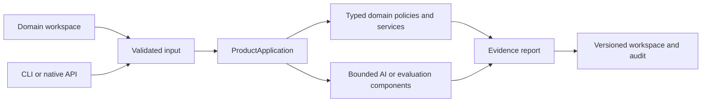

# Architecture — AI Evaluation Release Gate

## Execution boundaries

ProductApplication is the use-case boundary. Public project adapters preserve the original callable API while delegating behavior to the application package. Browser execution packages the same domain code and uses no server-side model credentials. The native service can use optional configured model providers through the shared bounded runtime.

## Component ownership

- `app/domain/validation.py`: Validates the complete suite and operating policy before optional inference.
- `app/domain/grading.py`: EvidenceGrader and AggregateStatistics calculate case evidence and nearest-rank p95.
- `app/domain/policy.py`: ReleasePolicy applies gates to unrounded aggregate values.
- `app/domain/experiments.py`: ExperimentIdentity and ReleaseExperiment own hashes, paired resampling, confidence intervals, cohorts and operating envelope.
- `app/ai/candidate.py`: CandidateGenerator executes the bounded optional model call.
- `app/application/product.py`: ProductApplication coordinates validation, inference, grading, policy and experiment reports.

## Architectural decisions

### ADR-01: Deterministic rubric plus optional candidate model

**Decision.** Keep outcome decisions inspectable. A learned grader would require expert labels and calibration data that this distribution does not pretend to possess.

### ADR-02: Pair responses on identical cases

**Decision.** A paired comparison removes suite-composition changes from the observed candidate delta. Changing source evidence changes the suite hash.

### ADR-03: Preserve separate pass gates

**Decision.** A high average cannot compensate for a failed operating or safety-oriented gate.

### ADR-04: Use bounded resampling

**Decision.** The seed and sample count make results repeatable without adding numerical dependencies. The UI always states the inference limitation.

## State and reproducibility

The domain calculation is isolated from workspace storage and does not mutate the input object. A saved scenario revision is an input artifact; an execution result binds that input to code provenance and calculated evidence. Review state belongs to the workspace, not to an implicit approval by a model. Browser storage and native SQLite storage are separate deployments and are not synchronized automatically.

## Trust boundaries

JSON input is untrusted. Domain validators enforce bounded sizes and numeric values. A configured model is untrusted output: semantic plans or narrative source identifiers must satisfy their contracts. The domain calculation controls facts and decisions. Importing a file never grants identity-backed access or executes arbitrary code.
