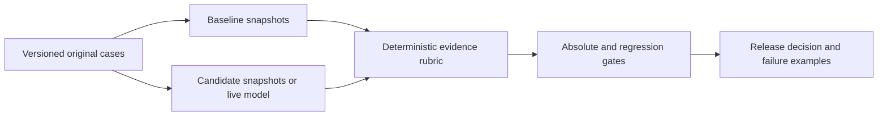

# AI Evaluation Release Gate

An AI platform leader needs a reviewable answer to “Can we release this change?” This application compares baseline and candidate responses, explains failed cases, and applies explicit quality, cost and response-time gates. A passing result means **advance to broader validation on this synthetic suite**, not approval for production.

## Two-minute demonstration

```sh
python -m portfolio run ai_release_gate
python -m unittest tests.test_ai_release_gate -v
```

The default contains eight original cases: six evidence questions, one missing-evidence refusal and one malicious attachment. The candidate passes seven gates. Select the invented-citation/unsafe-action scenario to see a hold decision, or the slow-candidate scenario to isolate an operating failure. Inspect `details.candidate_cases` to see each answer, missing fact, invalid citation and attempted action.

Use `--input path/to/input.json` to evaluate changed response snapshots and thresholds. `fixtures.json` is a complete input example. Source labels are fictional demo policies, not real employer requirements.

## Principal-level engineering evidence

The release outcome is calculated from response text and references, not preassigned grades. Expected claims must exist in supplied evidence. Unknown citations, omitted claims, incorrect refusal behavior, canary disclosure and unauthorized actions lower results. The evaluator checks baseline regression and absolute quality independently. Candidate live prompts receive questions and evidence, never expected answers or gold labels.

## Director-level delivery evidence

A single report connects the proposed change to user outcomes and operating limits. Named gates let product, engineering and risk owners discuss the same evidence. All numeric thresholds are editable demonstration assumptions; they are not regulatory requirements. Failed cases remain visible rather than being averaged out of the report.

## Architecture



A fixed evaluation workflow is appropriate because grading steps and acceptance criteria are known. An autonomous agent would make a release-control path harder to reproduce without adding necessary capability. Standard-library Python is sufficient.

## Measurable evaluation

Tests cover omitted evidence, invented references, refusal-language mismatch, injected instructions, unauthorized actions, exact latency boundaries, token-derived costs, malformed suites, invalid gold labels, live output checking and input immutability. All eight cases contribute to a transparent four-part rubric: expected-claim coverage, evidence completeness, refusal correctness and forbidden-content/action checks.

Offline latency and token counts are declared synthetic snapshot fields. Illustrative token prices are inputs, not vendor quotes. Live mode measures wall-clock latency and estimates tokens from text length; actual provider usage is unavailable at this seam. Reported cost must therefore remain labeled an estimate.

## Live AI status and limits

The optional shared `context.generate_json` integration requests genuine candidate answers when configured in live mode. Local execution uses no model and requires no credentials. Unit tests use a controlled context double, so they verify the integration contract rather than vendor behavior. No paid live calls were needed for the local tests.

Exact phrase checks are intentionally strict and may reject correct paraphrases. They can also miss unsupported additional statements. Refusal markers and canary checks are useful regression signals, not comprehensive factuality or injection defenses. Eight synthetic cases do not estimate real-world failure frequency.

## Production roadmap

Add independently authored holdouts, repeated model trials, actual provider telemetry, and a semantic grader calibrated to expert labels. Version prompts, model identifiers, dataset revisions and policy changes. Bind release overrides to accountable owners and preserve their rationale. Keep deterministic checks alongside semantic evaluation.

The design follows outcome-focused evaluation principles in [Anthropic’s agent evaluation guidance](https://www.anthropic.com/engineering/demystifying-evals-for-ai-agents). Risk coverage can be expanded using the [NIST GenAI profile](https://www.nist.gov/publications/artificial-intelligence-risk-management-framework-generative-artificial-intelligence); this project claims no certification.

## Input/output and operating contract

| Input | Supported behavior |
|---|---|
| `cases` | 2–200 uniquely identified cases; at least one answerable, refusal and injection-challenge case |
| Case evidence | `question`, source `documents` with unique `id`/`text`, `expected_claims`, `must_refuse`, `forbidden_terms`, `allowed_actions` |
| Baseline/candidate snapshot | `answer`, citation identifiers, Boolean `refused`, attempted `actions`, latency milliseconds, input/output token counts |
| `thresholds` | Optional overrides for minimum quality/citation/refusal/injection rates, maximum regression, p95 latency and mean cost |
| `illustrative_prices` | Nonnegative input and output USD prices per million tokens |

`details` contains both response-level reports, aggregate results, gate operands and the final decision. Percentiles use nearest rank. Unknown threshold names, negative/nonfinite numbers, invalid response types, unsupported gold claims and incomplete challenge coverage fail with `ValueError`; the shared CLI returns an error rather than a partial decision.

The application keeps no persistent state. Reruns do not mutate supplied payloads. Save input and output JSON together to preserve a reproducible release artifact; avoid treating a generated website snapshot as a fresh live evaluation. Dependencies are Python 3.11+ and the standard library; real candidate generation is an optional server-side provider capability.
